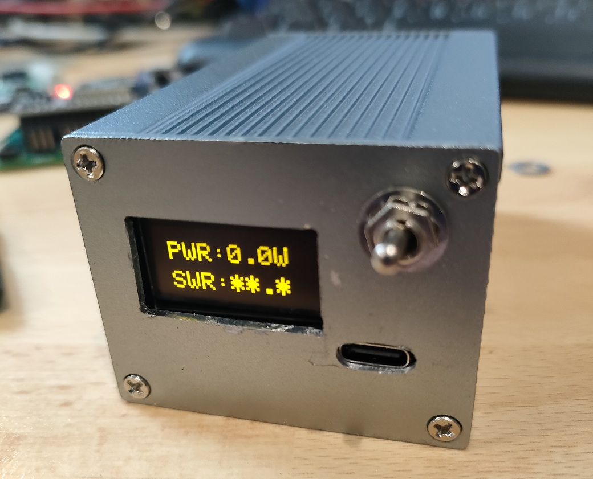
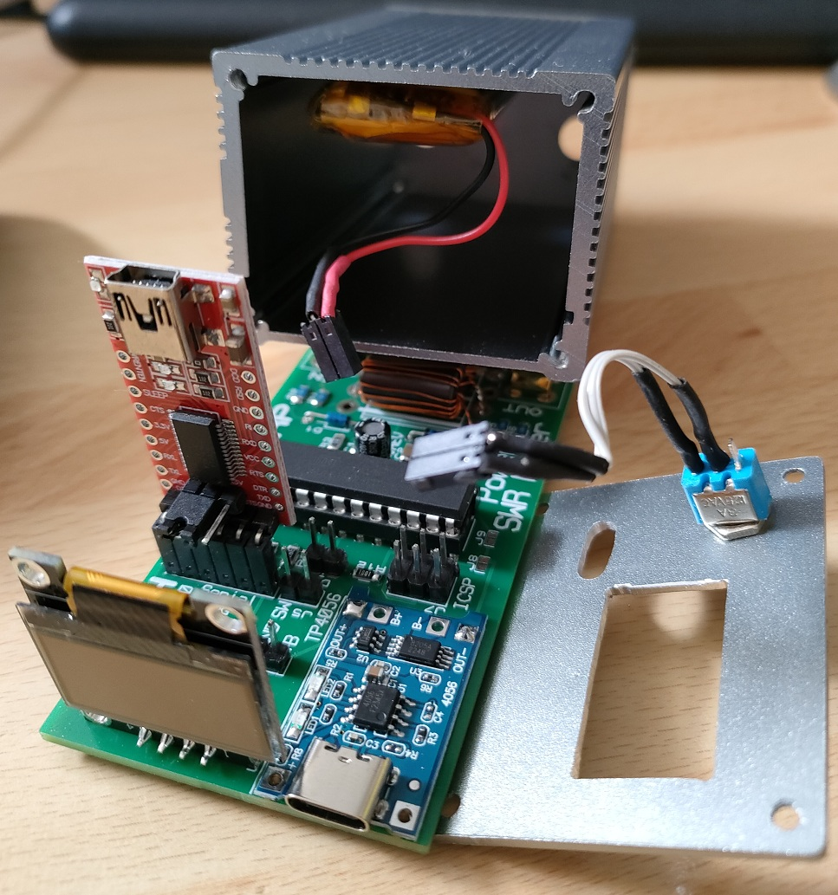
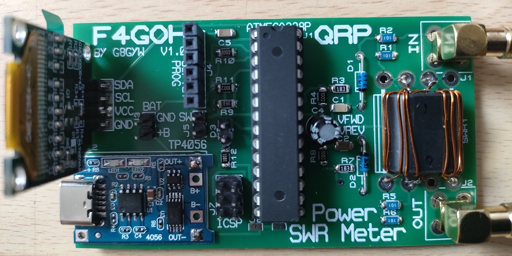
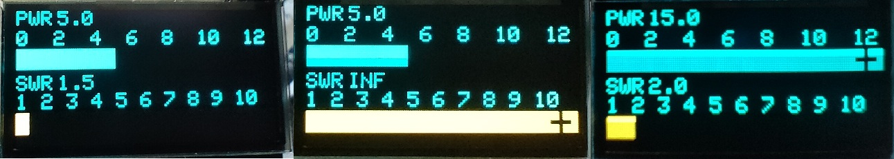
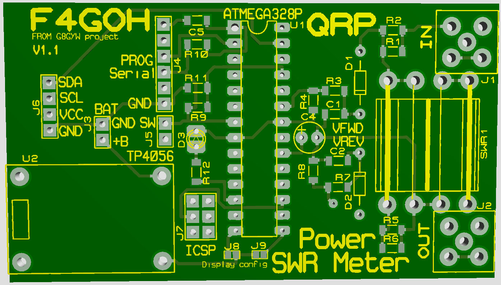

# pwr-swr-meter

## Features :

- 12 Watts max
- ATMEGA328p microcontroller with 8 Mhz internal clock;
- tandem match coupler with BN-43-202 ;
- SSD1306 Oled display;
- Serial connector for updating with FTDI232 module.
- BMS (battery management system)
- Battery 902535 800mA 3.7V

- the programmer used is a [XGECU - pro](https://www.aliexpress.com/premium/XGecu.html)
- It is capable of programming TMEGA328p.

- Initial project from [G8GYW](https://github.com/G8GYW/g8gyw.github.io)

## Display :

## PCB available :

