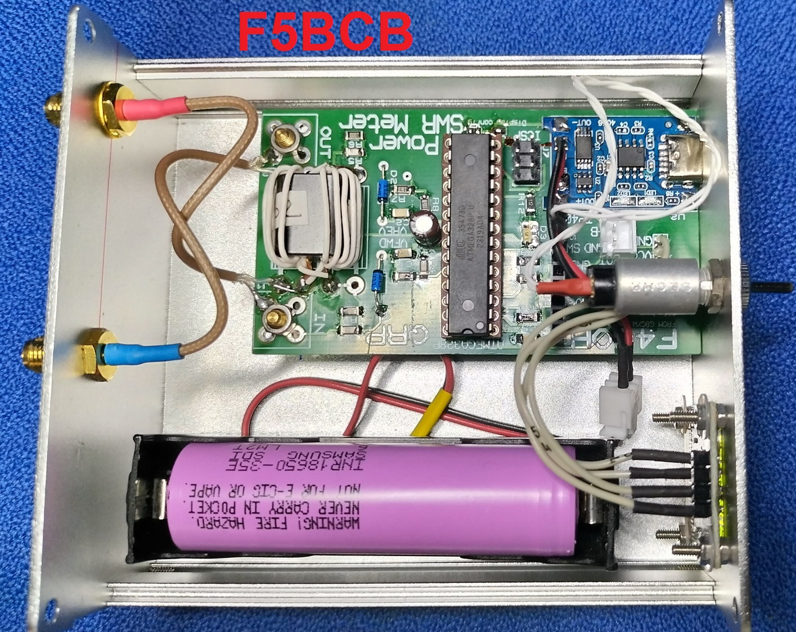

# PWR-SWR-METER

## Features :

- 12 Watts max ;
- ATMEGA328p microcontroller with 8 Mhz internal clock ;
- tandem match coupler with BN-43-202 ;
- SSD1306 Oled display ;
- F5BEG's bargraph software ;
- Serial connector for updating with FTDI232 module ;
- BMS (battery management system) ;
- Battery 902535 800mA 3.7V ;
- the programmer used for ATMEGA328p is a [XGECU - pro](https://www.aliexpress.com/premium/XGecu.html) ;
- Initial project from [G8GYW](https://github.com/G8GYW/g8gyw.github.io) for CONSTRUCTING THE TRANSFORMER BN-43-202 .

## Display :

## PCB available :

## F5BCB PWR-SWR-METER :

