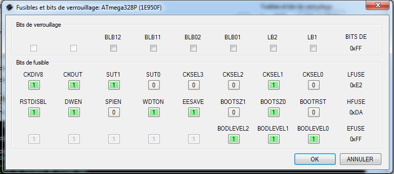
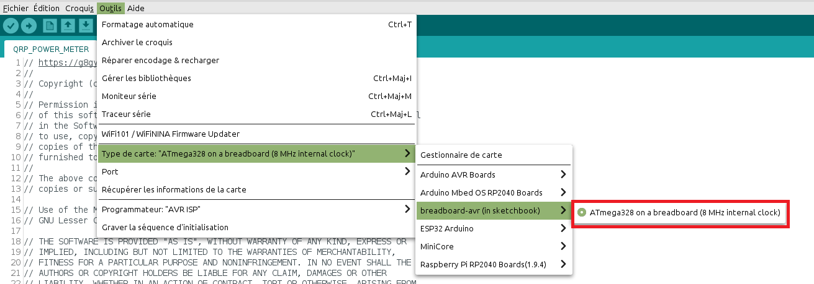

# Software programming with ISP and an Arduino UNO

Use [AVRDUDESS](https://github.com/ZakKemble/AVRDUDESS) with an Arduino UNO to program directly the bootloader and main software (firmware.hex)

## Program an Arduino UNO with AduinoISP software

## Connect the Arduino UNO with the SWR power meter

## Use Avrdudess and program 1,2 and 3

- Arduino board as programmer using arduino ISP firmware
- Select COM port
- Baud rate as 19200
- Select firmware.hex file
- choose write option with format intel HEX
- Select Erase flash and EEPROM
- Program!

- now check fuse config
- Write fuse config (it select internal 8Mhz clock in atMega328P with bootloader)

## Software updating :

if you want to update your own software :

- copy hardware folder into your own Documents/Arduino like C:\Users\anthony\Documents\Arduino
- No need to add MegunoLINK library, Filter.h is included
- Modify QRP_POWER_METER.ino main code
- Select breadBoard-avr in tools menu
- and upload

