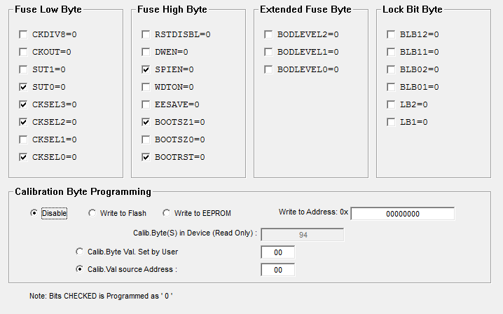
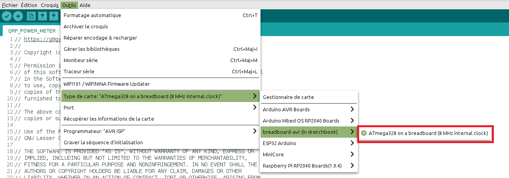

# Software programming

Use [XGECU - pro](https://www.aliexpress.com/premium/XGecu.html) to program directly the bootloader and main software (ATMEGA328P@DIP28.BIN)

use this fuse configuration

## Software updating :

if you want to update your own software :

- copy hardware folder into your own Documents/Arduino like C:\Users\anthony\Documents\Arduino
- No need to add MegunoLINK library, Filter.h is included
- Modify QRP_POWER_METER.ino main code
- Select breadBoard-avr in tools menu
- and upload

